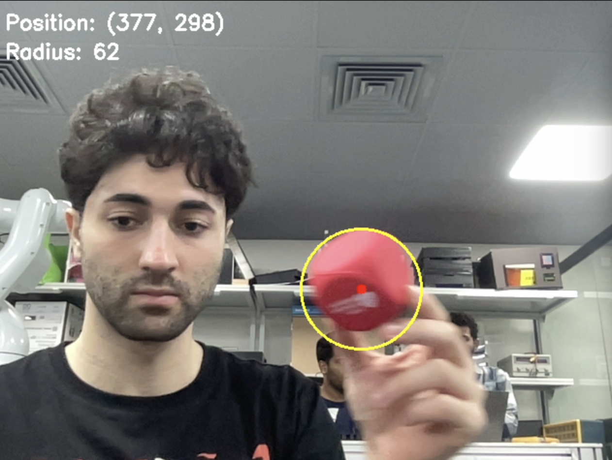
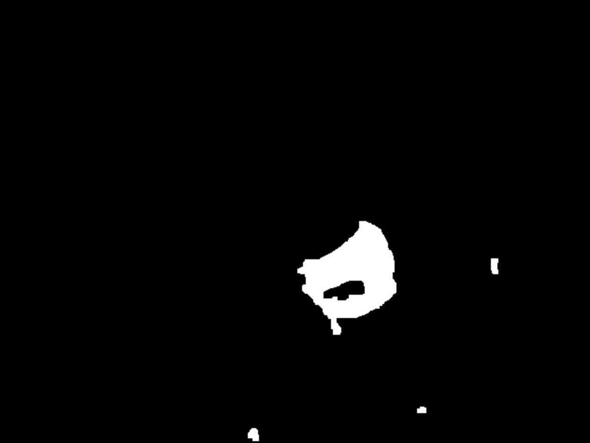

# Red Ball Tracking System – PDE 4432 Robot Control and Sensing

## Overview
This project presents a computer vision–based red ball tracking system employing HSV color segmentation for robust real-time detection.  
A calibration interface is integrated to enable fine control of detection thresholds, making the system adaptable to a variety of lighting conditions.  
The implementation forms a foundational component for future work involving servo-driven camera motion.

To illustrate the output, Figure 1 shows a sample frame of the camera feed with the detected red ball highlighted.  
Figure 2 displays the corresponding binarized mask used during the segmentation process.

   
  <em>Figure 1. Camera output showing the detected red ball and annotated bounding circle.</em>

   
  <em>Figure 2. Binary mask representation highlighting the segmented red regions.</em>

---

## Methodology

### 1. Video Capture and Preprocessing
The system captures live video at 640×480 resolution. Each frame undergoes horizontal mirroring for intuitive interaction, Gaussian smoothing for noise reduction, and a color-space conversion from BGR to HSV to facilitate more reliable segmentation under varying illumination.

### 2. Dual-Range HSV Color Segmentation
Red pixels are isolated using two hue intervals due to red’s wraparound nature in the HSV color model:
- Range A: H[0–10], S[120–255], V[70–255]  
- Range B: H[170–180], S[120–255], V[70–255]

The two masks are combined into a single binary representation. Figure 2 reflects this output, where white regions correspond to successfully identified red areas.

### 3. Morphological Filtering
To reduce fragmentation and remove spurious detections, erosion and dilation operations are applied. Kernel size and iteration count are adjustable, allowing tuning for different noise levels.

### 4. Contour Detection and Geometric Analysis
Contours are extracted from the processed mask. Only contours exceeding 100 pixels in area are considered valid. Minimum enclosing circle calculations determine ball location and size, which are then projected back onto the original camera stream as illustrated in Figure 1.

### 5. Visualization
The final display overlays:
- A circular marker around the detected ball  
- A center point indicator  
- Measurement annotations such as radius  
- Real-time calibration parameter readings  

---

## Calibration Interface

### HSV Parameter Controls
Trackbars allow real-time modification of:
- Hue lower and upper bounds (H1/H2)
- Saturation bounds (S1/S2)
- Value bounds (V1/V2)

Fine-tuning adjustments (LH, LS, LV, UH, US, UV) provide additional granularity.

### Noise-Related Controls
- Gaussian blur strength  
- Erosion and dilation intensity  
- Minimum radius threshold  

### Keyboard Commands
- **r**: Reset parameters  
- **s**: Save and print current calibration values  
- **q**: Exit program  

---

## System Architecture

### Core Functions
- `setup_trackbars()`: Builds calibration interface  
- `get_trackbar_values()`: Retrieves current parameter settings  
- `track_red_ball_with_calibration()`: Main processing loop  
- Contour extraction, mask filtering, and circle fitting  

### Color Space Rationale
The HSV model separates chromatic content (Hue) from illumination (Value), enabling more stable color extraction under variable lighting. This makes it more suitable than RGB for real-time object detection tasks.

---

## Future Work

### Phase 2: Servo Integration
- Establish Arduino serial communication  
- Map pixel coordinates to servo angles  
- Implement pan-tilt response for camera motion  
- Introduce proportional control for smoother tracking  

### Phase 3: Feature Enhancements
- Multi-object tracking  
- Persistent tracking across frames  
- Predictive motion modeling  
- Real-time performance optimization  

### Phase 4: System Deployment
- Replace on-screen calibration tools with stored presets  
- Improve error handling and recovery  
- Provide simplified user interface  

---

## Requirements
- Python 3.7+
- OpenCV (cv2)
- NumPy
- Functional webcam compatible with OpenCV

This work was completed as part of the PDE 4432 Robot Control and Sensing course and serves as a practical demonstration of computer vision’s role in robotic sensing and control.
