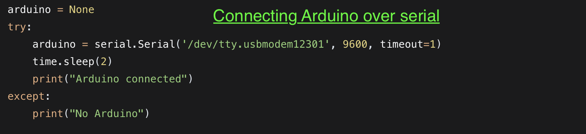
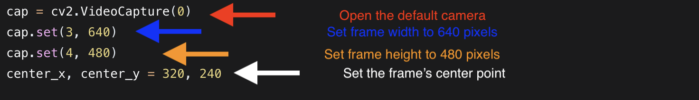
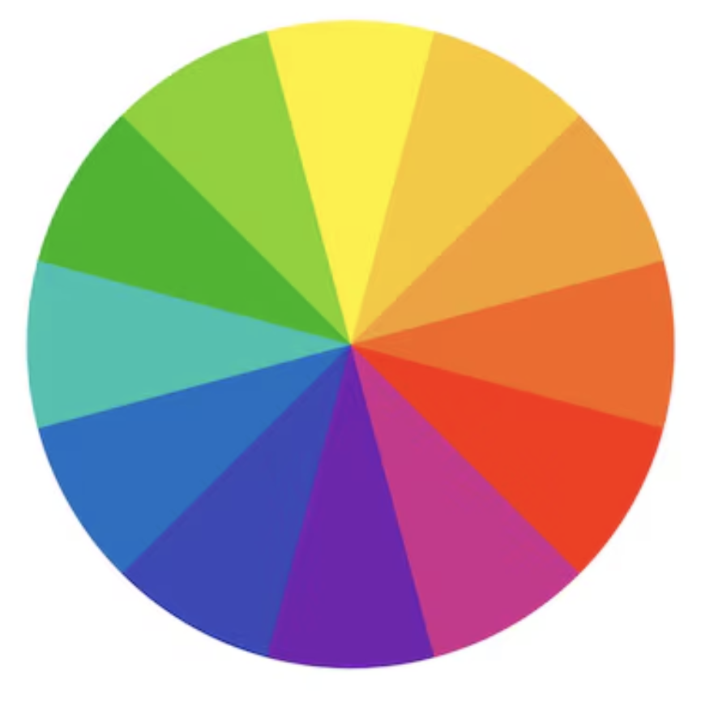
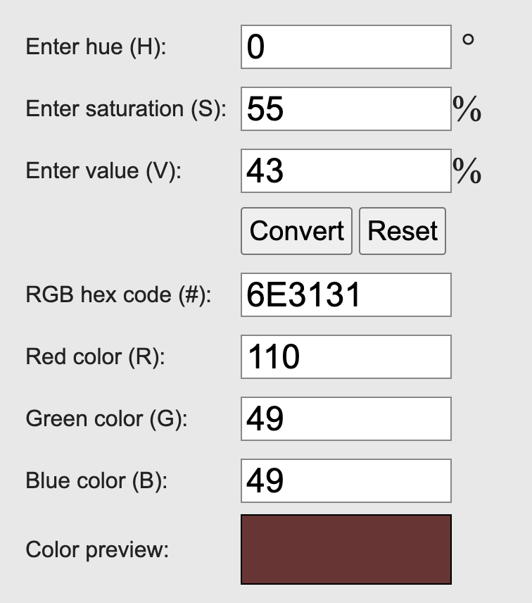
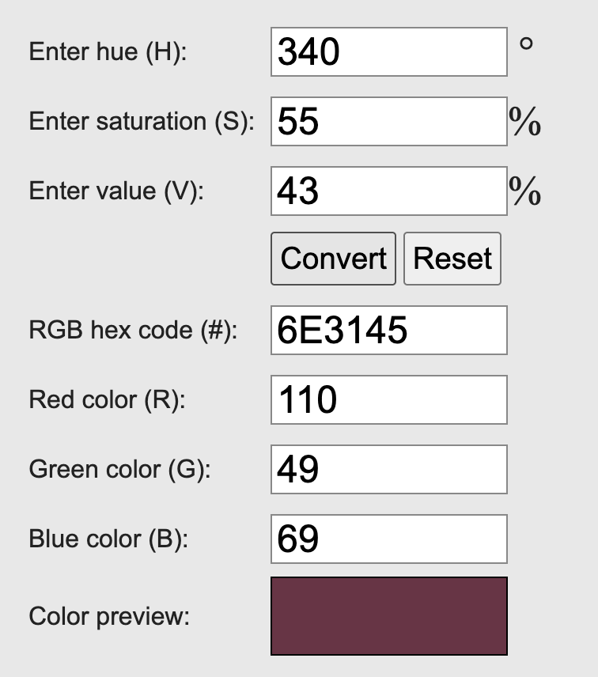
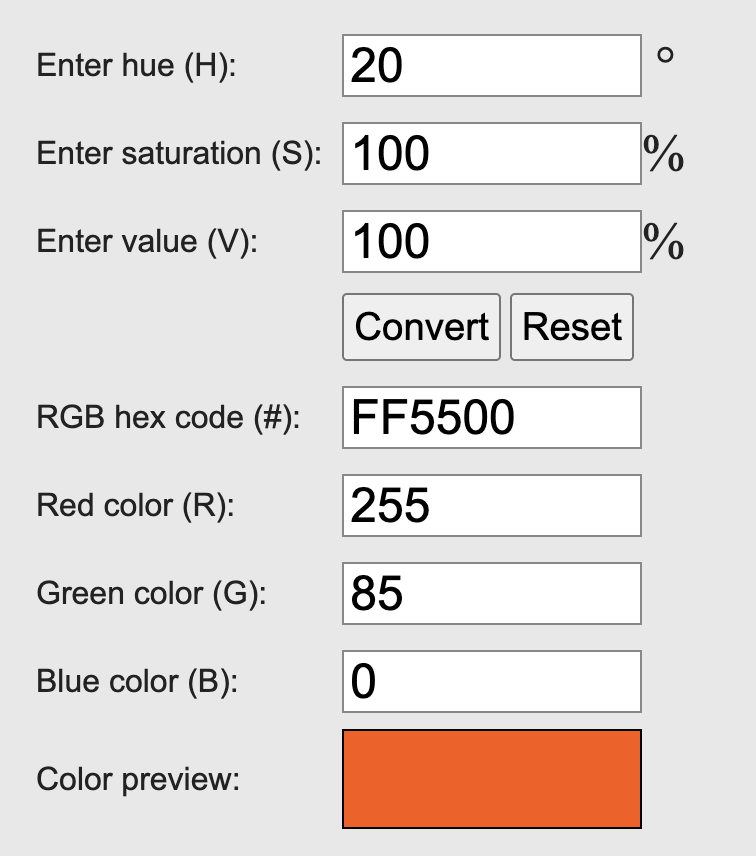
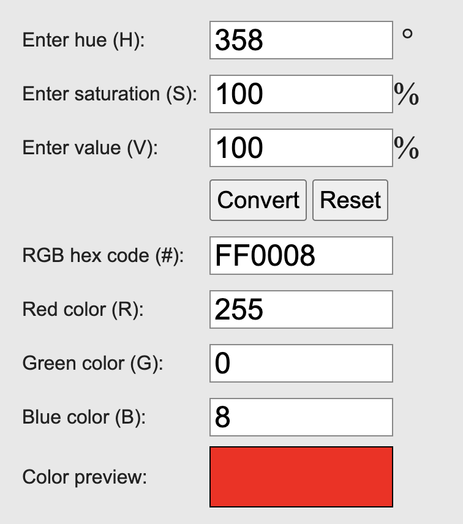
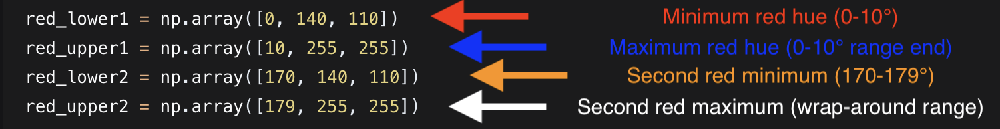
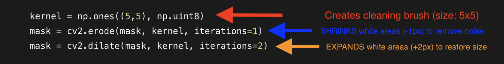
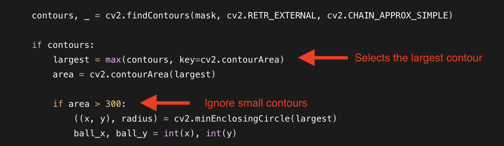

# Red Ball Tracking System  
### PDE 4432 — Robot Control and Sensing

## Overview
This project implements a computer-vision-based red ball tracking system using HSV color segmentation for reliable real-time detection. A calibration interface enables fine control of detection thresholds, allowing the system to adapt to a range of lighting conditions. The implementation forms the foundation for future work involving servo-driven camera motion.

Figure 1 illustrates a sample camera frame with the tracked red ball highlighted, while Figure 2 shows the corresponding binarized segmentation mask.

   
  <em>Figure 1. Camera output showing the detected red ball and annotated bounding circle.</em>

   
  <em>Figure 2. Binary mask representation highlighting the segmented red regions.</em>

---

## System Architecture and Implementation Stages

### 1. Hardware Communication Setup

   
  <em>Figure 3. Arduino serial communication setup for future servo integration.</em>

A serial connection is established with an Arduino microcontroller at 9600 baud. This rate balances throughput and stability for future real-time control. Robust error handling ensures the program halts safely if no Arduino is detected, preventing downstream failures in the tracking pipeline.

---

### 2. Video Capture Initialization

   
  <em>Figure 4. Camera frame configuration at 640×480 resolution.</em>

The system initializes the default camera and sets the resolution to 640×480. This resolution offers a balance between processing efficiency and spatial detail. The frame center (320, 240) is precomputed to support future pan–tilt control mapping.

---

### 3. HSV Color Space and Dual-Range Segmentation

  
   
  <em>Figure 5. HSV color representation: cylindrical model (left) and hue circle (right).</em>

The detection algorithm relies on the HSV color model, which separates chromatic information from illumination. OpenCV maps hue to a 0–180 scale, causing red to appear at both ends of the spectrum. To accommodate this wraparound, two independent hue ranges are required.

  
  
  
   
  <em>Figure 6. HSV threshold visualization for red segmentation.</em>

The system uses four threshold matrices:

- **Red Lower 1 (H 0–10):** Dark reddish-brown tones  
- **Red Upper 1 (H 0–10):** High-saturation, high-value red  
- **Red Lower 2 (H 170–180):** Dark purple tones  
- **Red Upper 2 (H 170–180):** Bright red at the spectrum boundary  

   
  <em>Figure 7. Real-time HSV threshold adjustment interface.</em>

The masks are combined using a bitwise OR operation and adjusted via a calibration interface, allowing adaptation to varying environments.

---

### 4. Morphological Filtering for Noise Reduction

   
  <em>Figure 8. Erosion and dilation operations for mask refinement.</em>

After segmentation, the binary mask may contain noise. A 5×5 erosion removes small artifacts, followed by dilation to restore object size. This opening operation preserves legitimate structure while eliminating fragmented noise. All kernel parameters remain adjustable.

---

### 5. Contour Analysis and Object Selection

   
  <em>Figure 9. Contour detection and largest-region selection.</em>

Contours are extracted from the refined mask. A minimum area threshold of 300 pixels removes insignificant detections. The largest contour is selected as the primary target, assuming the red ball appears as the largest contiguous region. A minimum enclosing circle provides position and radius estimates.

---

### 6. Visualization and Calibration Interface
Detection results are superimposed onto the camera feed, including the bounding circle, center point, and radius. A calibration panel provides controls for:

- HSV thresholds (dual-range)
- Morphological filtering strength
- Gaussian blur settings
- Minimum detection area

Keyboard commands:
- **r** — reset values  
- **s** — save configuration  
- **q** — quit  

---

## Methodology Summary

### Processing Pipeline
1. Hardware verification via Arduino serial connection  
2. 640×480 frame acquisition with mirrored display  
3. BGR to HSV color transformation  
4. Dual-range thresholding for complete red spectrum coverage  
5. Morphological filtering to reduce noise  
6. Contour extraction and filtering  
7. Minimum enclosing circle fitting  
8. Annotated visualization with calibration controls  

### Color Space Rationale
HSV decouples color from illumination, producing more stable red detection than RGB. The dual-range method ensures complete spectral coverage across the 0/180 hue wraparound, enabling robust performance under varied lighting.

---

## Future Work

### Phase 2: Servo Integration
- Real-time Arduino communication  
- Map pixel coordinates to servo angles (0–180°)  
- Implement proportional pan–tilt control  
- Add predictive tracking for latency compensation  

### Phase 3: Feature Enhancements
- Multi-object tracking with persistent IDs  
- Velocity estimation  
- Adaptive thresholding based on lighting analysis  
- Performance optimization for embedded systems  

### Phase 4: System Deployment
- Pre-tuned environmental profiles  
- Fail-safe behavior for occlusion events  
- Simplified user-facing interface  
- Complete documentation for instructional use  

---

## Requirements
- Python 3.7+  
- OpenCV 4.5+  
- NumPy  
- PySerial (for Arduino integration)  
- Functional webcam compatible with OpenCV  
- Arduino Uno with StandardFirmata (for future servo control)

---

This project was completed as part of the **PDE 4432 Robot Control and Sensing** course and demonstrates a complete computer vision pipeline—from raw video acquisition to actionable spatial information for robotic control.
